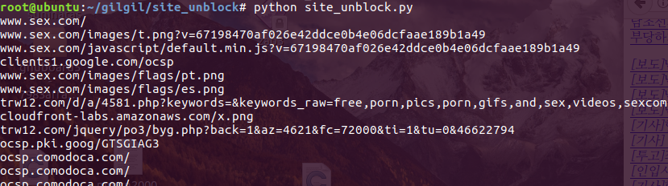

# Used Concept
파이썬에서 쓰레드를 생성하기 위해서는 threading 모듈 (High 레벨) 혹은 thread 모듈 (Low 레벨)을 사용할 수 있다  
필자는 thread를 사용하였다.
# site_unblock
Detouring "warning.or.kr" redirection  
웹 클라이언트로부터 HTTP Request를 받으면 Dummy HTTP Request를 붙여서 전송한다. 
웹 서버로부터 HTTP Response를 받으면 첫번째 HTTP Response를 빼고 클라이언트로 전송한다. 
proxy는 웹 클라이언트로부터의 multi connection 요청을 처리할 수 있어야 한다. 이를 위해 thread를 사용할 것인지, epoll을 사용할 것인지 iocp를 사용할 것인지는 알아서 할 것.  
# Usage
proxy 127.0.0.1 port 8080 설정

# Reference
https://docs.python.org/2/library/thread.html  
http://imarch.pe.kr/?p=1540

# Image description

	각 사진들의 url도 다 따오기때문에 사진들까지 보입니다.
